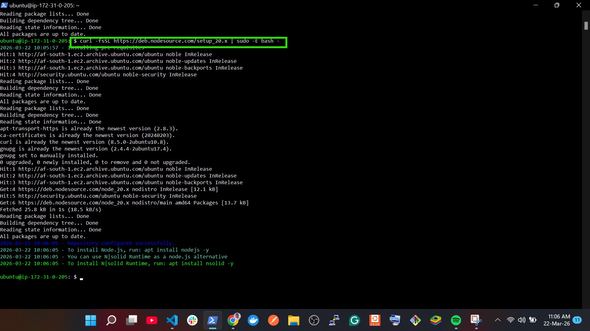
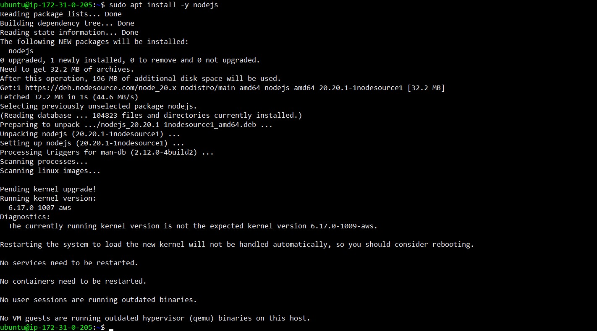
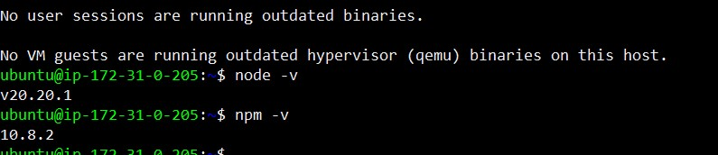
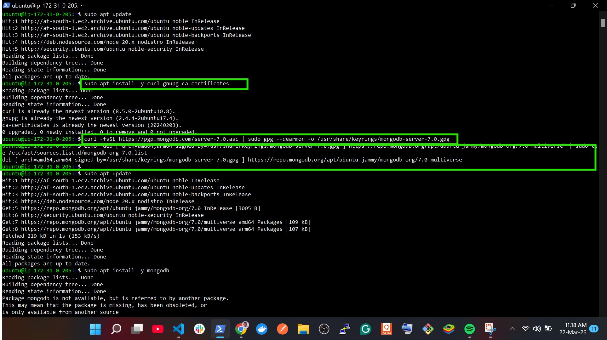
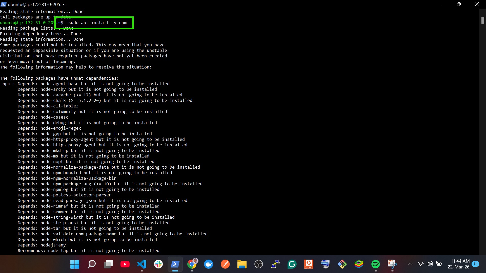
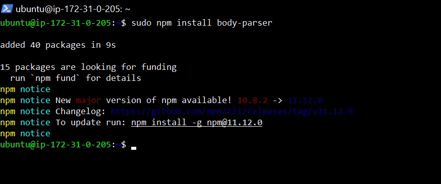
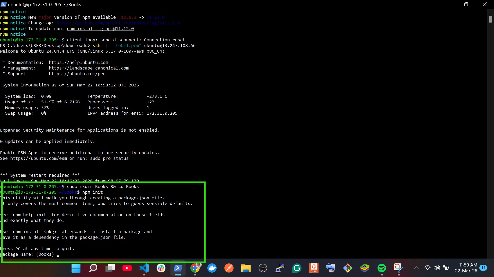
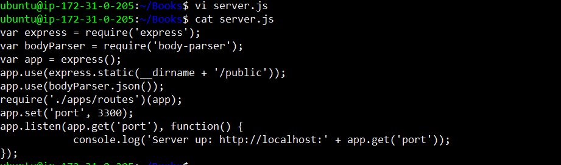
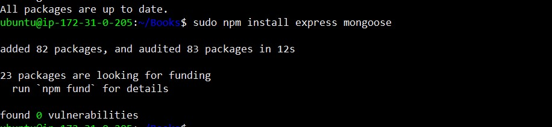

MEAN STACK DEPLOYMENT TO UBUNTU IN AWS

# Book Register MEAN Stack Project

## 1. Project Overview
The **Book Register** is a simple web application built using the **MEAN stack**:

- **MongoDB** – Document database (Stores book records (name, ISBN, author, pages)).  
- **Express** – Backend application framework (Handles API routes between client and database).  
- **AngularJS** – Frontend framework for dynamic views and client-side interaction.  
- **Node.js** – Runtime environment for executing JavaScript on the server.  

This project demonstrates a **full-stack web application** deployed on an **Ubuntu EC2 instance**

## 2. Prerequisites

- AWS account and EC2 instance (Ubuntu 20.04 LTS).  
- Node.js  
- MongoDB 
- npm installed.  
- Basic understanding of terminal/SSH commands.

## 3. Project Setup
   ### Step 0- Launch an ec2 instance on aws and ssh

   ### Step 1 – Update system and install Node.js
 using

 ```bash
 sudo apt update
 ```

```bash
 sudo apt upgrade
```

#add certificate
```bash
sudo apt -y install curl dirmngr apt-transport-https lsb-release ca-certificates
```


NOTE: The Certificate command installs important system tools that help your server download and verify software securely and it is often run before setup scripts.


# run this command
```bash
curl -fsSL https://deb.nodesource.com/setup_20.x | sudo -E bash -
```

NOTE: This command:

Downloads a setup script from NodeSource, Runs it as administrator, Adds Node.js 20 repository to Ubuntu, Prepares your system to install Node.js 20. So after running it, you can install Node.js 20



# next install nodejs to the latest version. 
run
```bash
sudo apt install -y nodejs
```


verify installation

# run

```bash
nodejs -v
npm -v
```


### Step 2: Install Mongodb

NOTE: The version of MONGODB in the task 4 project is old so these are the updated version and run the command below accordingly

Install Required Tools by running the command below:
```bash
sudo apt update

sudo apt install -y curl gnupg ca-certificates

# Add MongoDB Official Key (Modern Way)

curl -fsSL https://pgp.mongodb.com/server-7.0.asc | sudo gpg --dearmor -o /usr/share/keyrings/mongodb-server-7.0.gpg

# Add MongoDB Repo (Jammy = Compatible with 24.04)

echo "deb [ arch=amd64,arm64 signed-by=/usr/share/keyrings/mongodb-server-7.0.gpg ] https://repo.mongodb.org/apt/ubuntu jammy/mongodb-org/7.0 multiverse" | sudo tee /etc/apt/sources.list.d/mongodb-org-7.0.list
```




# update package list
```bash
sudo apt update
```
# install mongodb

```bash
sudo apt install -y mongodb-org
```


# start,enable and check mongodb status

#run
```bash
sudo systemctl start mongod

sudo systemctl enable mongod

sudo systemctl status mongod
```


# Test It (If it opens then MongoDB is ready) and press exit :
```bash
mongosh
```

# install npm (node package manager)

```bash
sudo apt install -y npm
```


# install body-parser,this package helps us process JSON files passed in requests to the server:

```bash
sudo npm install body-parser
```


# Create folder named Books
```bash
mkdir Books && cd Books
```
# in the Books directory initialize npm project


```bash
npm init
```


# create a server.js file in the Books directory
```bash
vi server.js

# Copy and paste the web server code below into the server.js file.

var express = require('express');
var bodyParser = require('body-parser');
var app = express();
app.use(express.static(__dirname + '/public'));
app.use(bodyParser.json());
require('./apps/routes')(app);
app.set('port', 3300);
app.listen(app.get('port'), function() {
    console.log('Server up: http://localhost:' + app.get('port'));
});
```



### Step 3: Install Express and set up routes

Express is a minimal and flexible Node.js web application framework that provides features for web and mobile applications. We will use Express to pass book information to and from our MongoDB database.

We also will use Mongoose package which provides a straightforward, schema-based solution to model your application data. We will use Mongoose to establish a schema for the database to store data of our book register.

In your Book directory run this command:
```bash
sudo npm install express mongoose
```


In Books folder, create a folder named apps

mkdir apps && cd apps

Create a file named routes.js

nano routes.js

Copy and paste the code below into routes.js

var Book = require('./models/book');

module.exports = function (app) {

  // Get all books
  app.get('/book', async function (req, res) {
    try {
      const result = await Book.find({});
      res.json(result);
    } catch (err) {
      res.status(500).json({ error: err.message });
    }
  });

  // Add new book
  app.post('/book', async function (req, res) {
    try {

      const book = new Book({
        name: req.body.name,
        isbn: req.body.isbn,
        author: req.body.author,
        pages: req.body.pages
      });

      const result = await book.save();

      res.json({
        message: "Successfully added book",
        book: result
      });

    } catch (err) {
      res.status(500).json({ error: err.message });
    }
  });

  // Delete book
  app.delete('/book/:isbn', async function (req, res) {
    try {

      const result = await Book.findOneAndDelete({
        isbn: req.params.isbn
      });

      if (!result) {
        return res.status(404).json({
          message: "Book not found"
        });
      }

      res.json({
        message: "Successfully deleted the book",
        book: result
      });

    } catch (err) {
      res.status(500).json({ error: err.message });
    }
  });

  // Catch all routes
  app.all(/.*/, function (req, res) {
    res.status(404).json({ message: "Route not found" });
  });

};


