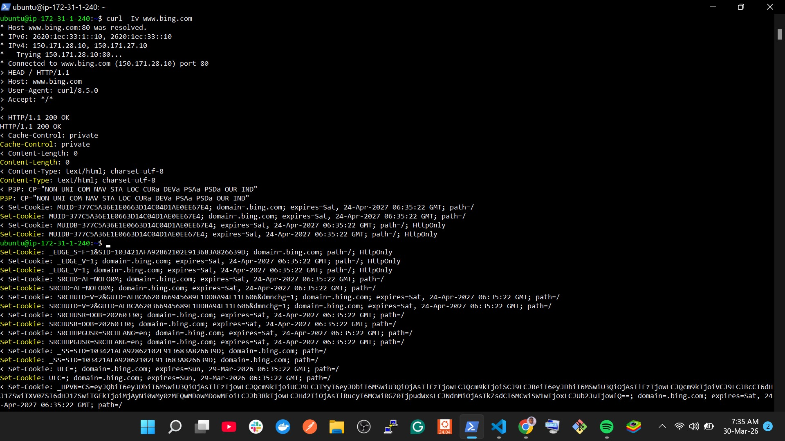
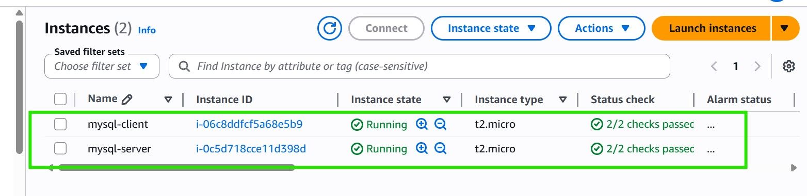

# Project 5: Client-Server Architecture Using MySQL Management Database (DBMS) 


## 📌 Overview
This project demonstrates a **Client-Server architecture** using MySQL on two Ubuntu-based AWS EC2 instances:

Client-Server refers to an architecture in which two or more computers are connected together over a network to send and receive requests between one another. In their communication, each machine has its own role: the machine sending requests is usually referred as "Client" and the machine responding (serving) is called "Server". A simple diagram of Web Client-Server architecture is presented below:


 
In the example above, a machine that is trying to access a Web site using a Web browser or simply ‘curl’ command is a client and it sends HTTP requests to a Web server (Apache, Nginx, IIS or any other) over the Internet. If we extend this concept further and add a Database Server to our architecture, we can get this picture:

Simple put;The client sends requests to the server, and the server processes requests and returns responses. MySQL is used as the database management system (DBMS).


The Web Server has a role of a "Client" that connects and reads/writes to/from a Database (DB) Server (MySQL, MongoDB, Oracle, SQL Server or any other), and the communication between them happens over a Local Network (it can also be an Internet connection, but it is a common practice to place Web Server and DB Server close to each other in a local network).
Essentially, it is sending requests to the remote server, and in turn, would be expecting some kind of response from the remote server. Let’s take a very quick example and see Client-Server communicatation in action. Open up your Ubuntu or Windows terminal and run the curl command:

```bsh
curl -Iv www.bing.com
```

Note: If your Ubuntu does not have ‘curl’, you can install it by running sudo apt install curl In this example, your terminal will be the client, while www.bing.com will be the server.

See the response from the remote server in the below output. You can also see that the requests from the URL are being served by a computer with an IP address 150.171.28.10 on port 80.



---

## Step 1: Create and configure two Linux-based virtual servers (EC2 instances in AWS).

Server A name - mysql-server
Server B name - mysql-client




```bash
sudo apt update
sudo apt install mysql-server -y
```

sudo mysql_secure_installation
Follow prompts
Set a strong root password
Remove test databases if prompted
👤 Step 3: Create Database and User

Login to MySQL server:
sudo mysql -p