# Project 1: Web Stack Implementation (LAMP Stack) on AWS

##  Project Overview
This project demonstrates the deployment of a LAMP stack (Linux, Apache, MySQL, PHP) on an AWS EC2 instance running Ubuntu 20.04.
The goal is to understand core DevOps concepts such as Linux administration, web servers, databases, networking, and cloud infrastructure.

##  Technologies Used
- Cloud Provider: AWS (EC2)
- Operating System: Ubuntu 20.04 LTS
- Web Server: Apache2
- Database: MySQL 8
- Backend Language:PHP 7.4
- Protocol: SSH (TCP Port 22), HTTP (TCP Port 80)

##  Architecture
Client → Internet → AWS EC2 (Ubuntu)
- Apache handles HTTP requests
- PHP processes dynamic content
- MySQL stores application data

##  Step-by-Step Implementation

### Step 0: Prerequisites
- AWS Free Tier Account

I already have an aws Account, you can create one if you do not
launch an EC2 instance (t2.micro)
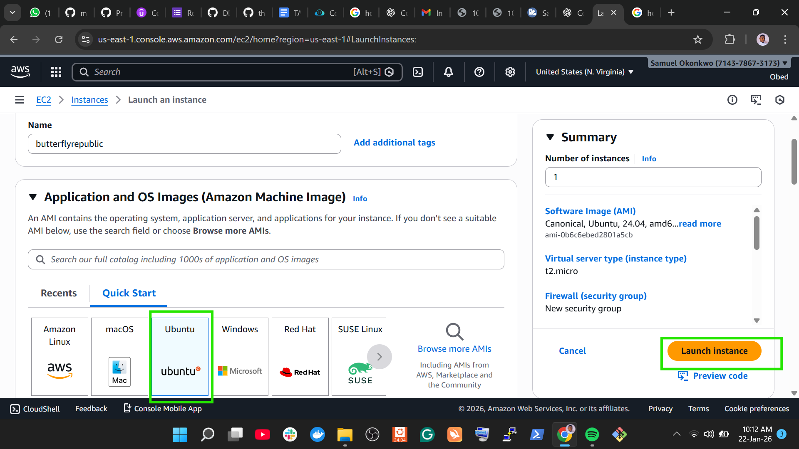

connect the instance using ec2 instance connect on aws
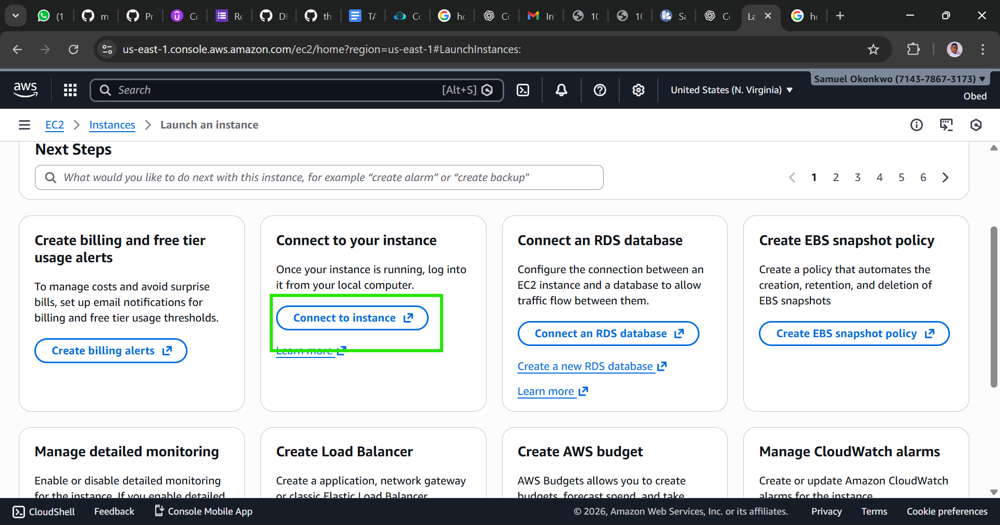
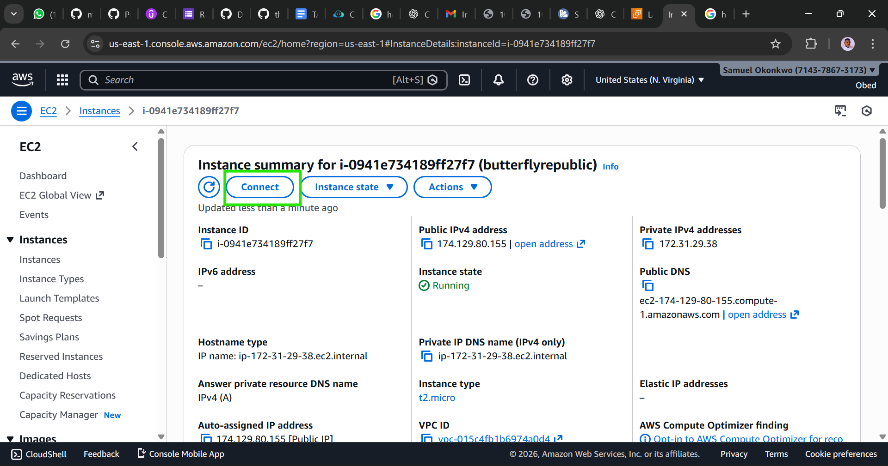
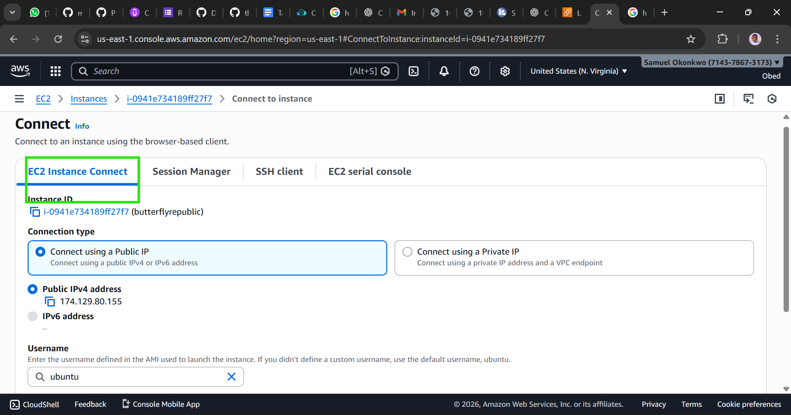
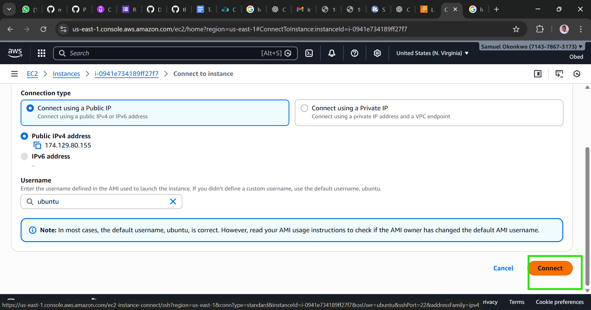

---

### Step 1: Install Apache2 and update the firewall

Update a list of packages in package manager sudo apt update
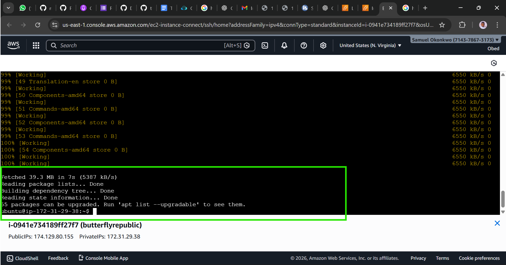

Run apache2 package installation sudo apt install apache2
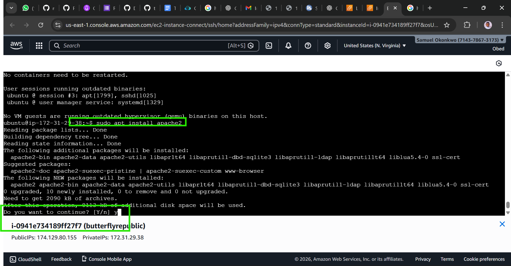

To verify that apache2 is running as a Service in our OS, use following command sudo systemctl status apache2
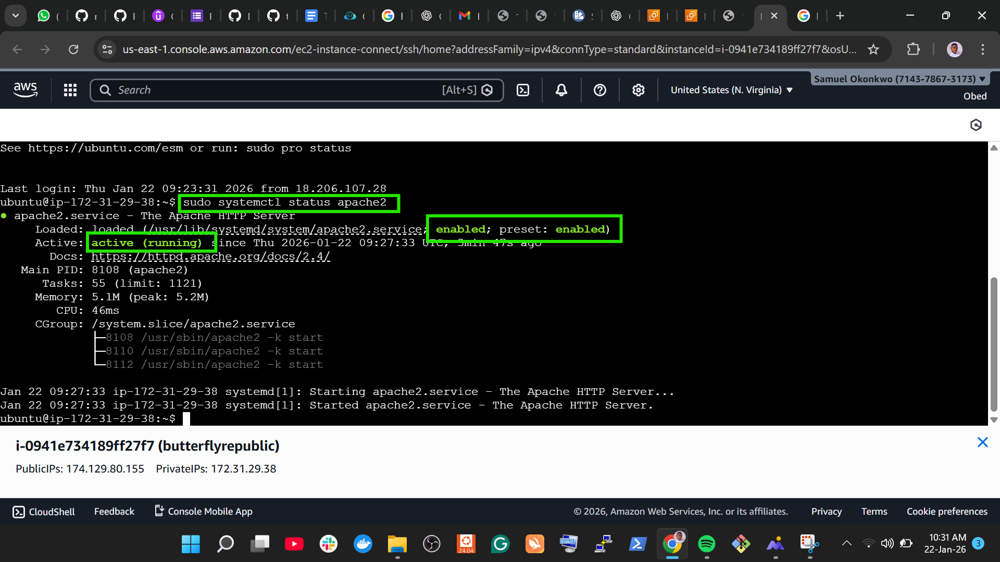

Open inbound connection through port 80 this is done by editing inbound rules in the security groups
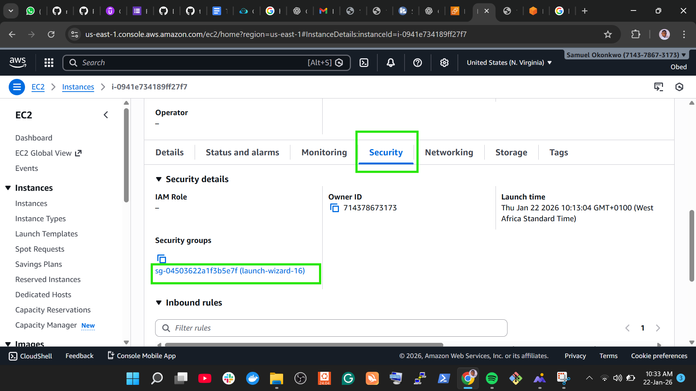

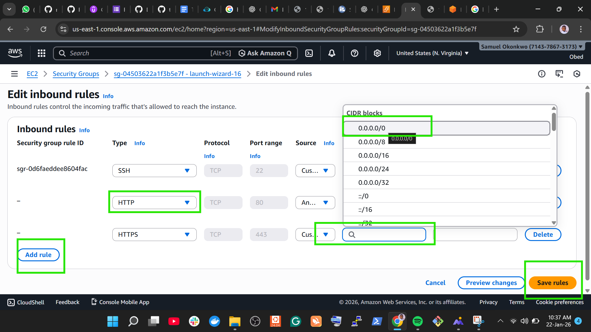

To view the Apache default page, Go to http://Public-IP-Address:80 in your browser
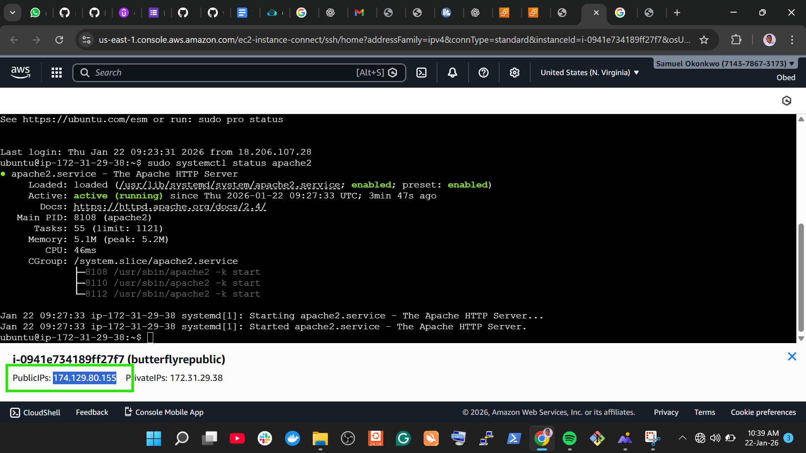
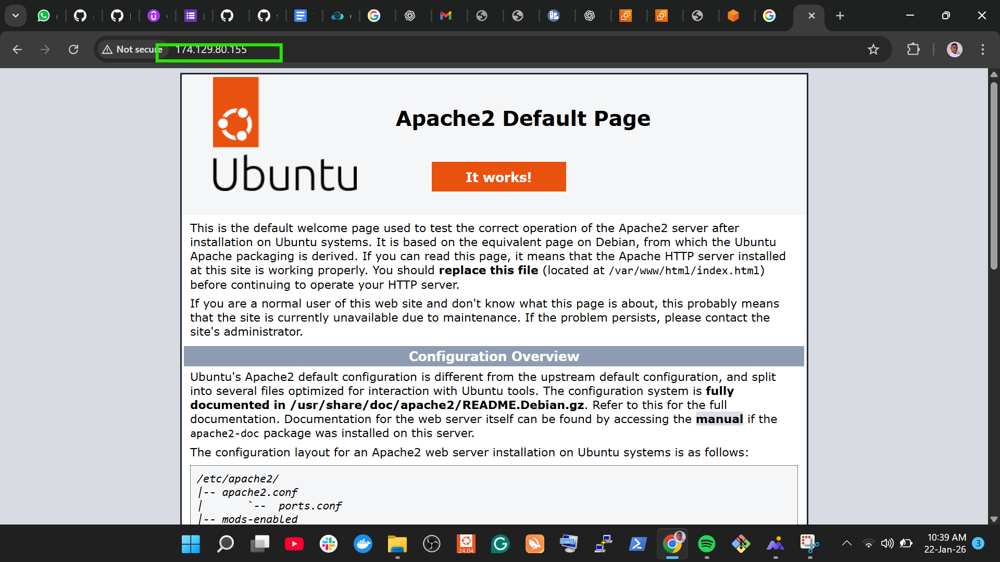

### Step 2: Install MySQL
sudo apt install mysql-server

When prompted, confirm installation by typing Y, and then ENTER.
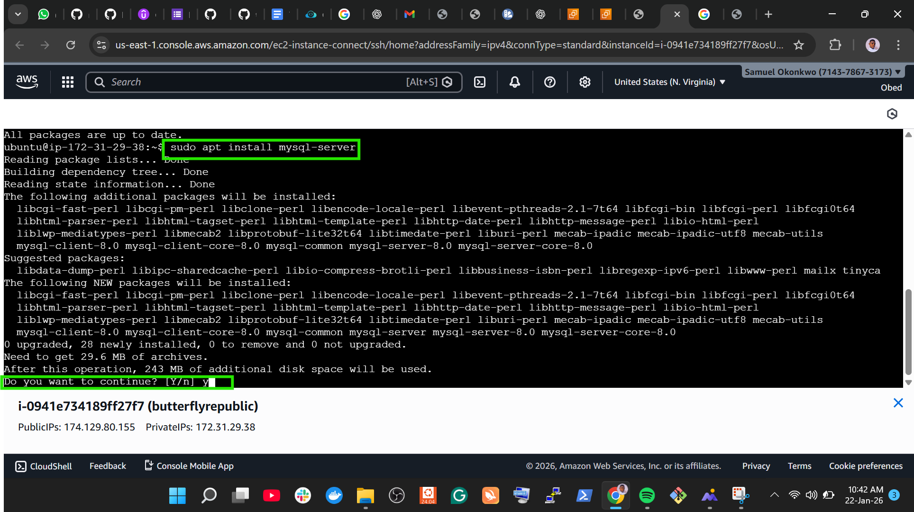

When the installation is finished, log in to the MySQL console by typing:
sudo mysql
This will connect to the MySQL server as the administrative database user root, which is inferred by the use of sudo when running this command.
Define the users password using this command:
ALTER USER 'root'@'localhost' IDENTIFIED WITH mysql_native_password BY 'PassWord.1'
Exit the MySQL shell with:
mysql> exit

Run security script:
sudo mysql_secure_installation 
This will ask if you want to configure the VALIDATE PASSWORD PLUGIN.
Answer Y for yes, or anything else to continue without enabling

When you’re finished, test if you’re able to log in to the MySQL console by typing:
sudo mysql -p
To exit the MySQL console, type: mysql> exit

### Step 3:Install PHP
To install these 3 packages at once, run:
sudo apt install php libapache2-mod-php php-mysql
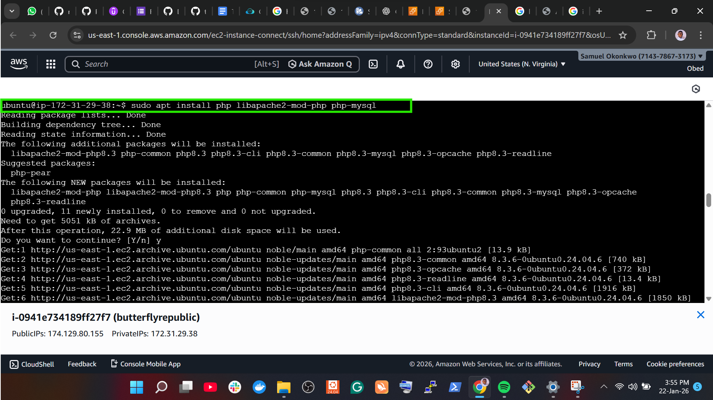
Once the installation is finished, you can run the following command to confirm your PHP version:
php -v
[php version](images/017-php-check.png)

 LAMP stack is completely installed and fully operational.

Linux (Ubuntu)
Apache2 HTTP Server
MySQL and
PHP

### Step 4:Creating a virtual host for your website using apache2

Create the directory for 'newproject' using mkdir command as follows:
sudo mkdir /var/www/projectlamp
assign ownership of the directory with your current system user:
sudo chown -R $USER:$USER /var/www/projectlamp
Create and open a new configuration file in Apache’s sites-available directory using: 
sudo vi /etc/apache2/sites-available/projectlamp.conf

Paste in the following bare-bones configuration
<VirtualHost *:80> ServerName projectlamp ServerAlias www.projectlamp ServerAdmin webmaster@localhost DocumentRoot /var/www/projectlamp ErrorLog ${APACHE_LOG_DIR}/error.log CustomLog ${APACHE_LOG_DIR}/access.log combined </VirtualHost>

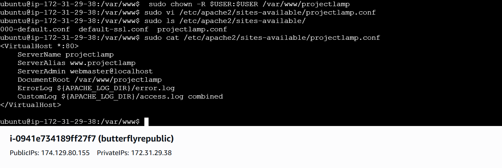

use the ls command to show the new file in the sites-available directory:
sudo ls /etc/apache2/sites-available

use the a2ensite command to enable the new virtual host:
sudo a2ensite projectlamp

To disable Apache’s default website use a2dissite command, type:
sudo a2dissite 000-default

to ensure your configuration file doesn’t contain syntax errors, run:
sudo apache2ctl configtest

Finally, reload Apache so these changes take effect:
sudo systemctl reload apache2

Your new website is now active, but the web root /var/www/projectlamp is still empty
Create an index.html file in that location so that we can test that the virtual host works as expected, run: 
echo "Hello LAMP from hostname $(curl -s http://169.254.169.254/latest/meta-data/public-hostname) with public IP $(curl -s http://169.254.169.254/latest/meta-data/public-ipv4)" | sudo tee /var/www/projectlamp/index.html

Now go to your browser and try to open your website URL using IP address: http://<Public-IP-Address>:80
If you see the text from ‘echo’ command you wrote to index.html file, then it means your Apache virtual host is working as expected.

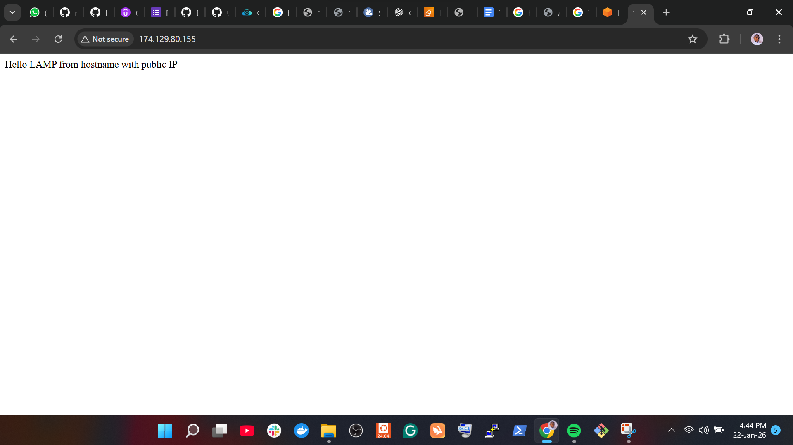

### Step 5: Enable PHP on the website
With the default DirectoryIndex settings on Apache, a file named index.html will always take precedence over an index.php file.

sudo vim /etc/apache2/mods-enabled/dir.conf
to change this behavior,edit the /etc/apache2/mods-enabled/dir.conf file and change the order in which the index.php file is listed within the DirectoryIndex directive

edit it thus:
<IfModule mod_dir.c> #Change this: #DirectoryIndex index.html index.cgi index.pl index.php index.xhtml index.htm #To this: DirectoryIndex index.php index.html index.cgi index.pl index.xhtml index.htm </IfModule>

save and close the file. then reload apache so that changes can take effect
sudo systemctl reload apache2
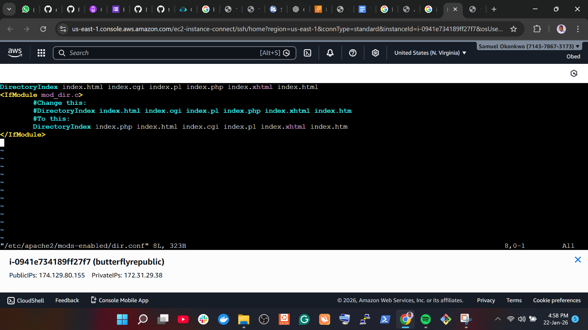
Finally, we will create a PHP script to test that PHP is correctly installed and configured on your server.

Create a new file named index.php inside your custom web root folder:
sudo vim /var/www/projectlamp/index.php
This will open a blank file. Add the following text, which is valid PHP code, inside the file:
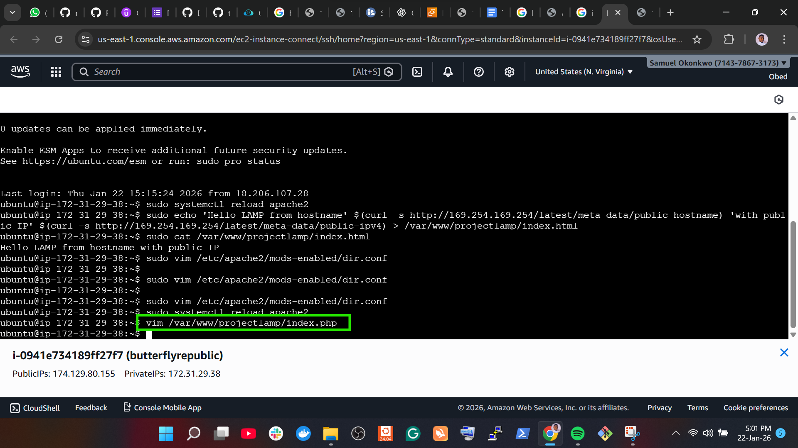
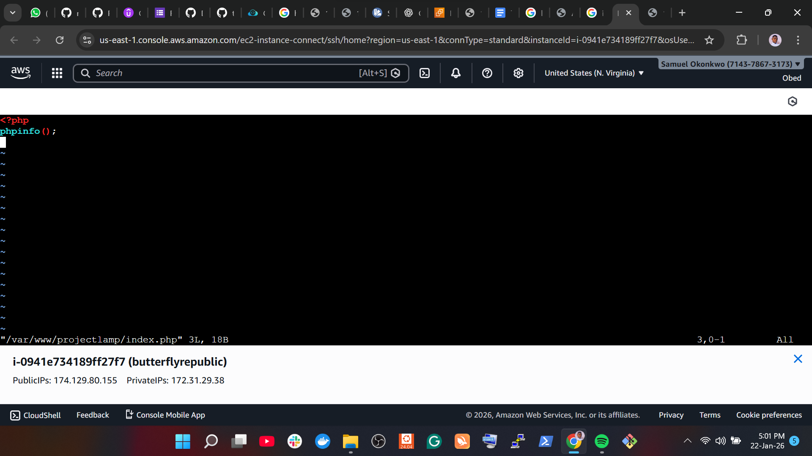

When you are finished, save and close the file, refresh the page and you will see a page similar to this:
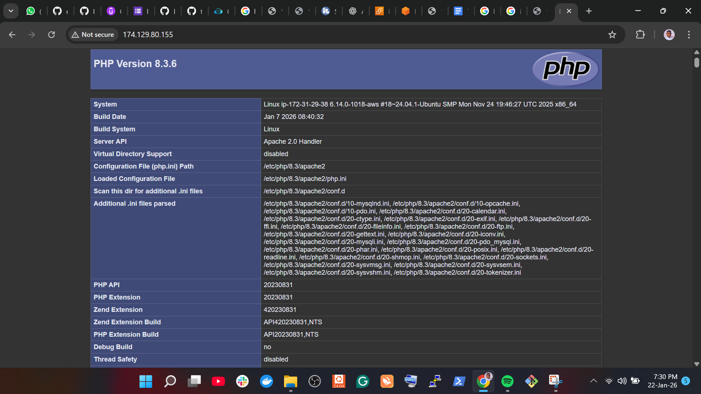

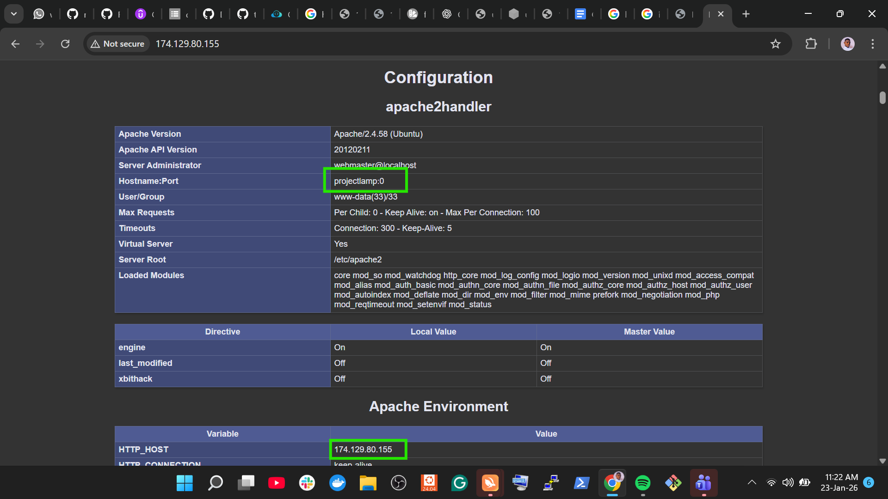

Key Learnings

Linux server administration
Web stack architecture (LAMP)
Apache virtual hosts
AWS EC2 provisioning

Author

The One butterflyRepublic
