# Project 2: WEB STACK IMPLEMENTATION (LEMP STACK)

## Introduction

This project demonstrates the implementation of a **LEMP stack** (Linux, Nginx, MySQL, PHP) on an AWS EC2 instance running Ubuntu Linux.

The LEMP stack is a popular open-source web application stack used for hosting dynamic websites and web applications. In this project, Nginx is used as the web server, MySQL as the database management system, and PHP as the server-side scripting language.

This project builds on the knowledge gained from Project 1 (LAMP stack) and introduces Nginx as an alternative web server.


## What is LEMP Stack?

LEMP stands for:

* **L** – Linux (Operating System)
* **E** – Nginx (Web Server, pronounced "Engine-X")
* **M** – MySQL (Database Server)
* **P** – PHP (Programming Language)

Architecture diagram:

Client Browser → Nginx → PHP-FPM → MySQL Database → Response to Browser


## Project Objectives

* Launch an Ubuntu EC2 instance on AWS
* Install and configure Nginx web server
* Install and secure MySQL database server
* Install PHP and PHP-FPM
* Configure Nginx to use PHP processor
* Create and query a MySQL database using PHP
* Display database content in the browser


## Step 0 – Launch EC2 Instance
I already have an AWS account

An Ubuntu Server EC2 instance was launched on AWS.

Instance details:

* OS: Ubuntu 24.04 LTS
* Instance type: t2.nano
* Open ports:

  * 22 (SSH)
  * 80 (HTTP)

Connect to server:
i ssh into my local pc (my window powershell) using


ssh -i kepair ubuntu@<Public-IP>


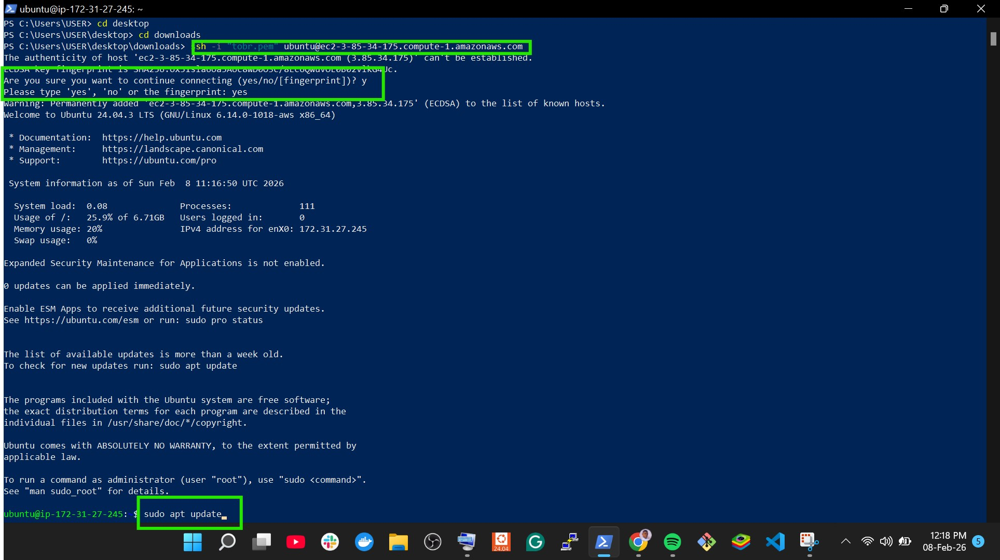

## Step 1 – Install Nginx

Update system packages:

```bash
sudo apt update
```

Install Nginx:

```bash
sudo apt install nginx 
```

Verify Nginx status:

```bash
sudo systemctl status nginx

```


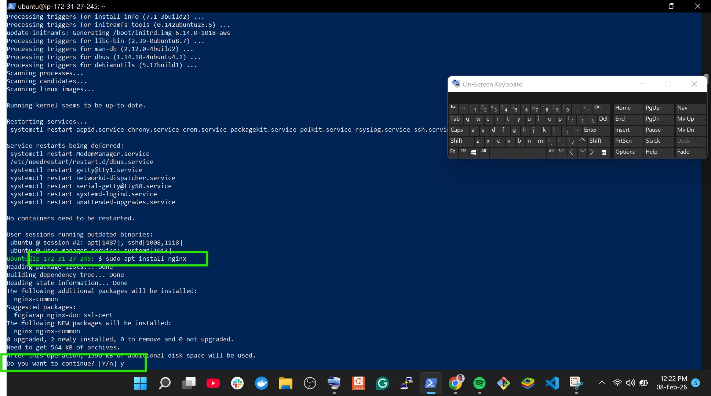
Test locally:

```bash
curl http://localhost:80

```
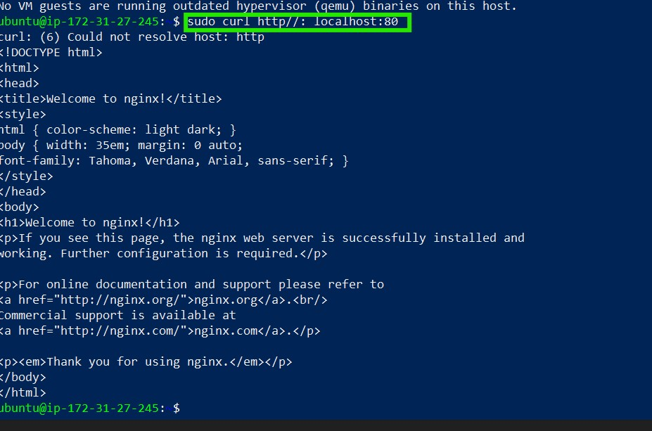
Test from browser:

```
http://<Public-IP>
```

Expected result: Nginx default page.
[Images](Images/004-nginx-web.jpg)

---

## Step 2 – Install MySQL

Install MySQL server:

```bash
sudo apt install mysql-server
```
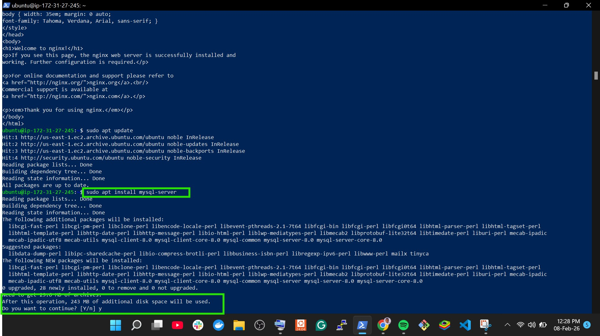
Login to MySQL:

```bash
sudo mysql
```
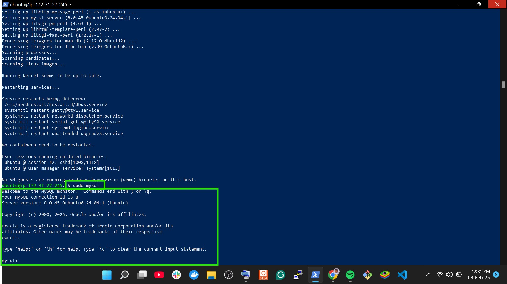

It’s recommended that you run a security script that comes pre-installed with MySQL. This script will remove some insecure default settings and lock down access to your database system. Before running the script, you will set a password for the root user, using mysql_native_password as default authentication method. We’re defining this user’s password as PassWord.1.
ALTER USER 'root'@'localhost' IDENTIFIED WITH mysql_native_password BY  'PassWord.1';

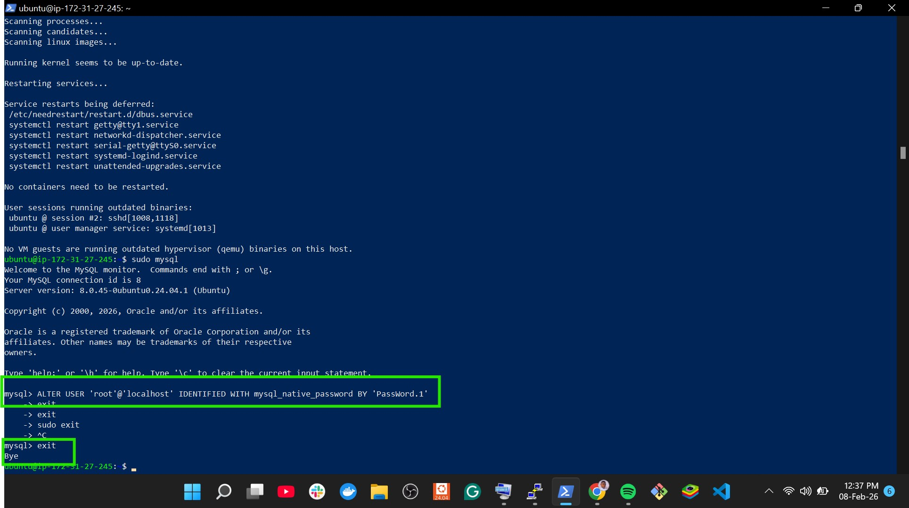
Secure MySQL installation:

```bash
sudo mysql_secure_installation
```
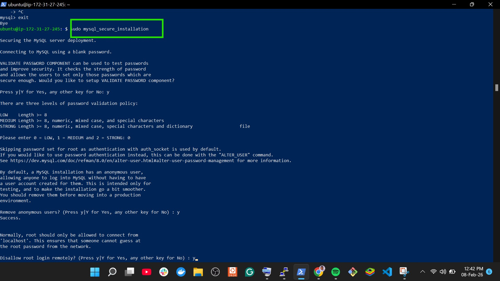
---

## Step 3 – Install PHP and PHP-FPM

Install PHP components:

```bash
sudo apt install php-fpm php-mysql
```

Verify PHP version:

```bash
php -v
```

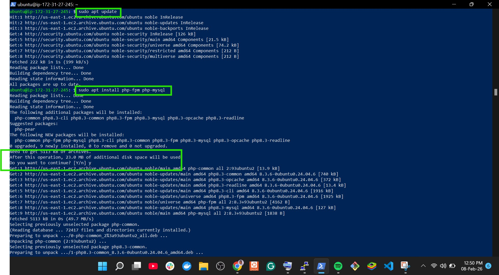

## Step 4 – Configure Nginx Server Block

Create web root directory:

```bash
sudo mkdir /var/www/projectLEMP
```

Assign ownership:

```bash
sudo chown -R $USER:$USER /var/www/projectLEMP
```

Create Nginx configuration file:

```bash
sudo nano /etc/nginx/sites-available/projectLEMP
```

Add configuration:

```nginx
server {
    listen 80;
    server_name <Public-IP>;

    root /var/www/projectLEMP;
    index index.php index.html index.htm;

    location / {
        try_files $uri $uri/ =404;
    }

    location ~ \.php$ {
        include snippets/fastcgi-php.conf;
        fastcgi_pass unix:/var/run/php/php8.3-fpm.sock;
    }

    location ~ /\.ht {
        deny all;
    }
}
```

Enable configuration:

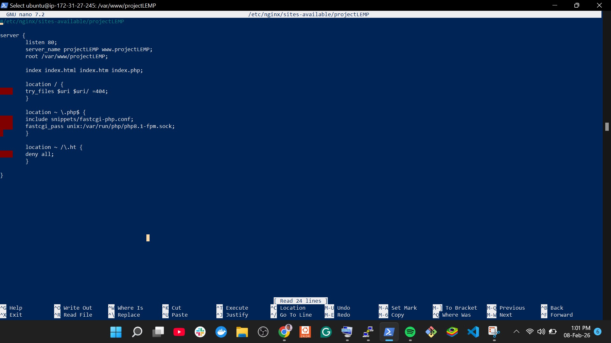

```bash
sudo ln -s /etc/nginx/sites-available/projectLEMP /etc/nginx/sites-enabled/
```
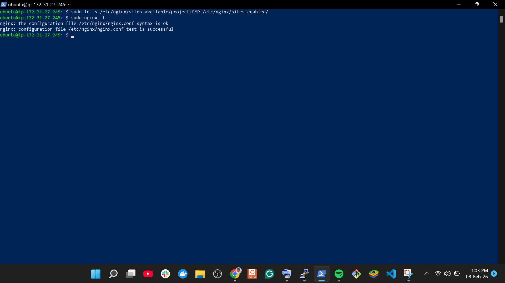
Disable default site:

```bash
sudo rm /etc/nginx/sites-enabled/default
```

Test configuration:

```bash
sudo nginx -t
```

Restart Nginx:

```bash
sudo systemctl restart nginx
```
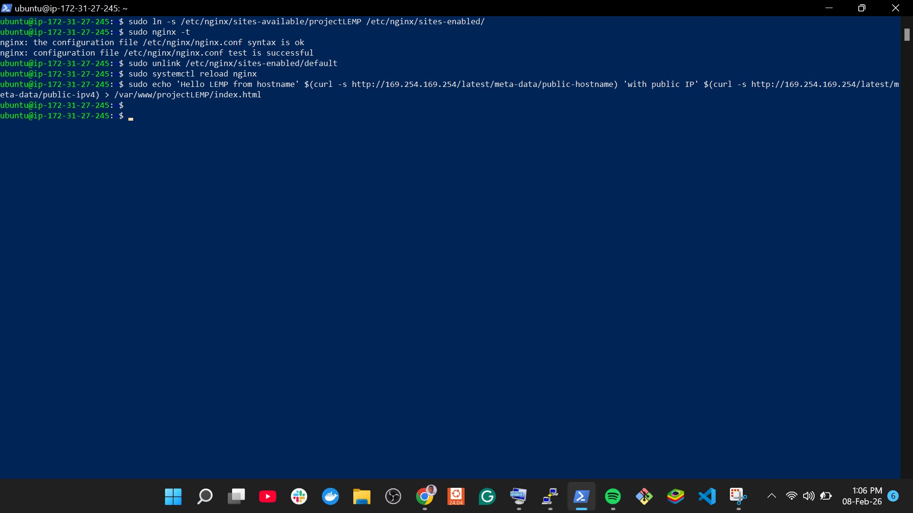

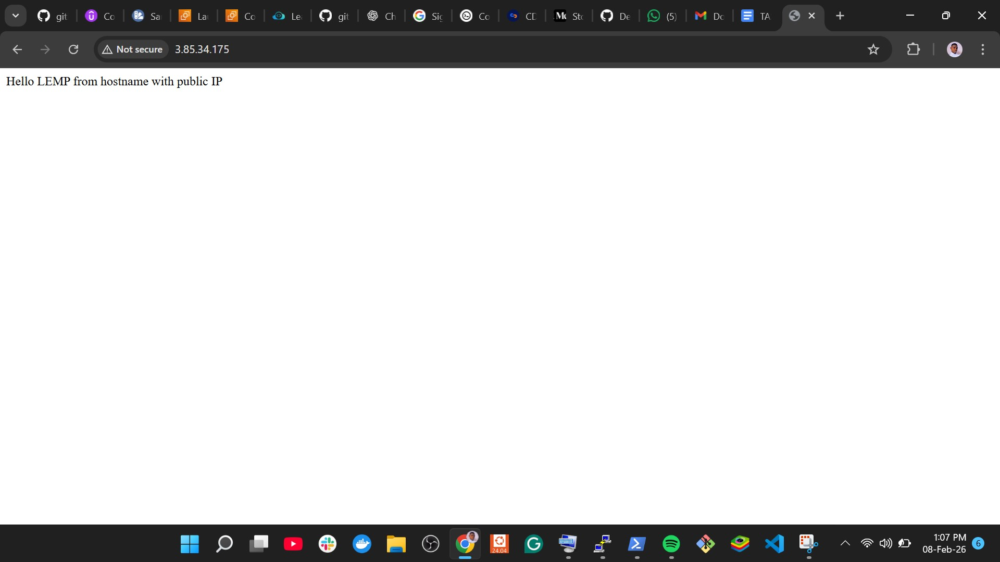


## Step 5 – Test PHP Processing

Create PHP test file:

```bash
nano /var/www/projectLEMP/info.php
```

Add:

```php
<?php
phpinfo();
```
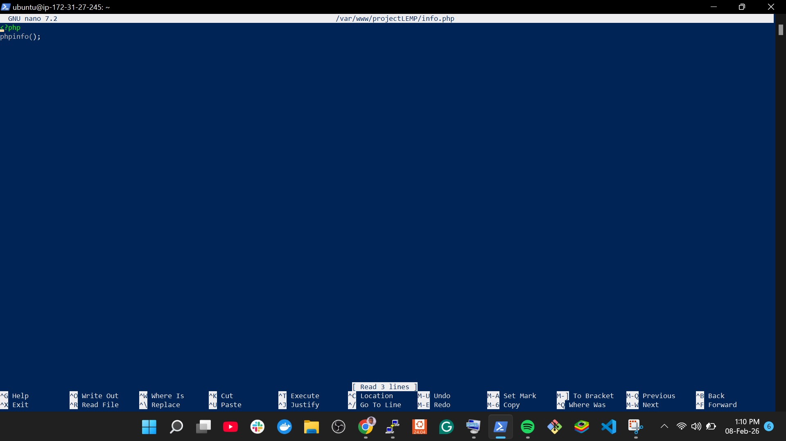
Test in browser:

```
http://<Public-IP>/info.php
```
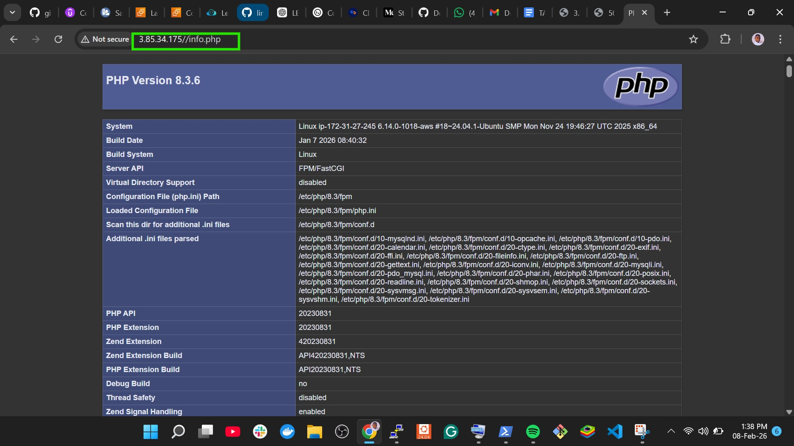
Result: PHP information page displayed.

Remove file for security:

```bash
sudo rm /var/www/projectLEMP/info.php
```


## Step 6 – Create MySQL Database and User

Login to MySQL:

```bash
sudo mysql
```

Create database:

```sql
CREATE DATABASE example_database;
```

Create user:

```sql
CREATE USER 'example_user'@'%' IDENTIFIED WITH mysql_native_password BY  'password';
```
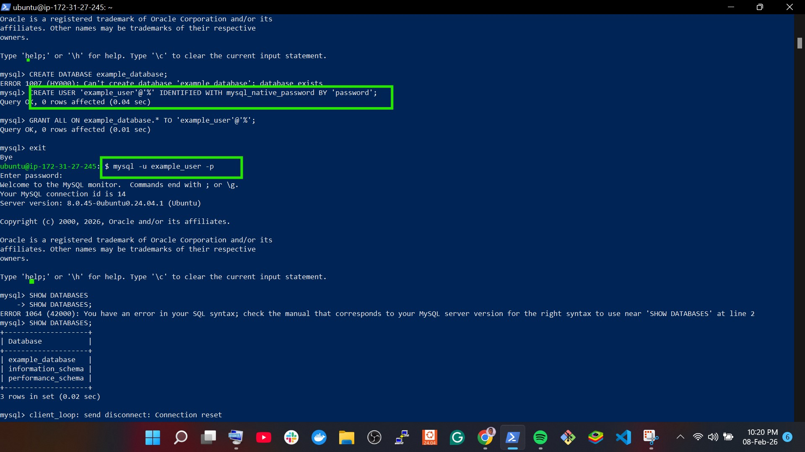
Grant privileges:

```sql
GRANT ALL PRIVILEGES ON example_database.* TO 'example_user'@'%';
```
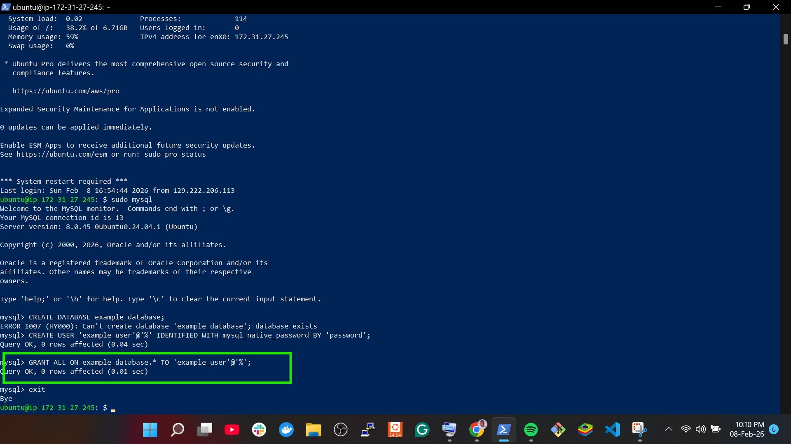
Exit MySQL:

```sql
exit;
```

---

## Step 7 – Create Database Table

Login:

```bash
mysql -u example_user -p
```

Create table:

```sql
CREATE TABLE example_database.todo_list (
    item_id INT AUTO_INCREMENT,
    content VARCHAR(255),
    PRIMARY KEY(item_id)
);
```

Insert data:

```sql
INSERT INTO example_database.todo_list (content) VALUES ("My First important item");
INSERT INTO example_database.todo_list (content) VALUES ("Buy groceries");
INSERT INTO example_database.todo_list (content) VALUES ("Finish LEMP stack setup");
INSERT INTO example_database.todo_lis (content) VALUES ("Learn PHP and MySQL")
```
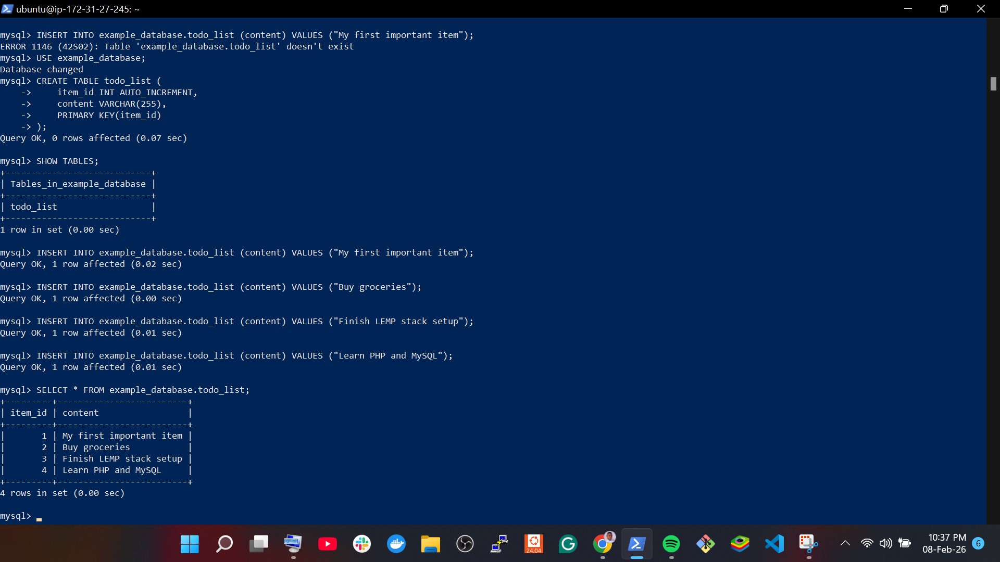
Verify data:

```sql
SELECT * FROM example_database.todo_list;
```


## Step 8 – Create PHP Script to Retrieve Data

Create file:

```bash
nano /var/www/projectLEMP/todo_list.php
```

Add:

```php
<?php
$user = "example_user";
$password = "Password";
$database = "example_database";
$table = "todo_list";

try {
    $db = new PDO("mysql:host=localhost;dbname=$database", $user, $password);

    echo "<h2>TODO LIST</h2><ol>";

    foreach($db->query("SELECT content FROM $table") as $row) {
        echo "<li>" . $row['content'] . "</li>";
    }

    echo "</ol>";

} catch (PDOException $e) {
    print "Error!: " . $e->getMessage();
    die();
}
?>
```
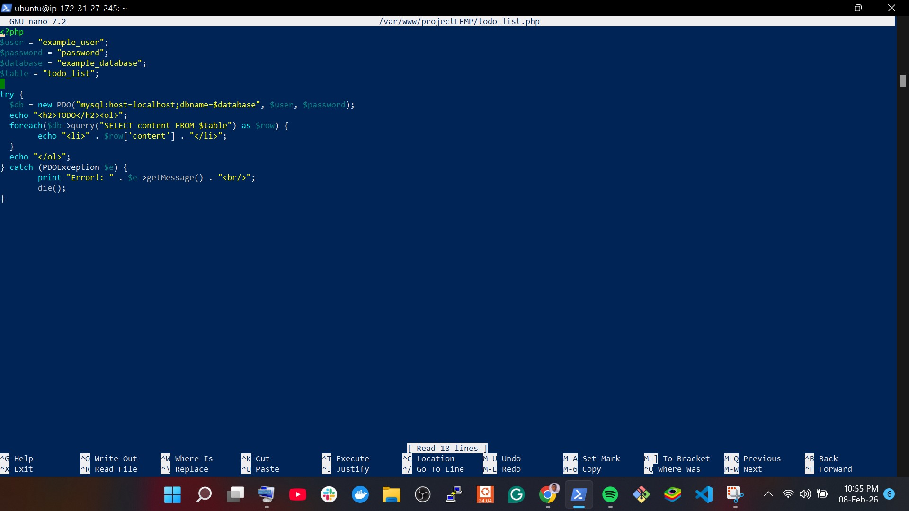
Test in browser:

```
http://<Public-IP>/todo_list.php
```

Result: Database content displayed successfully.

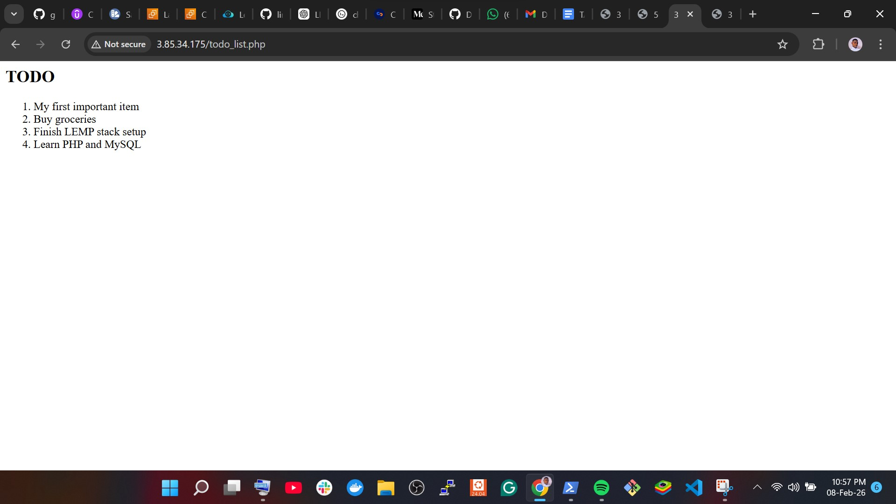

## Project Outcome

Successfully implemented a fully functional LEMP stack:

* Nginx serving web pages
* PHP processing dynamic content
* MySQL storing application data
* PHP retrieving and displaying database data


## Challenges Faced

* 502 Bad Gateway error due to incorrect PHP-FPM socket version
* Fixed by updating Nginx configuration to correct PHP version


## Key Skills Gained

* AWS EC2 provisioning
* Linux server administration
* Nginx configuration
* MySQL database management
* PHP integration with MySQL
* Troubleshooting web server errors


## Conclusion

This project successfully demonstrated how to deploy and configure a complete LEMP stack environment. The system is capable of serving dynamic web applications and interacting with databases efficiently.


## Author

butterflyRepublic
